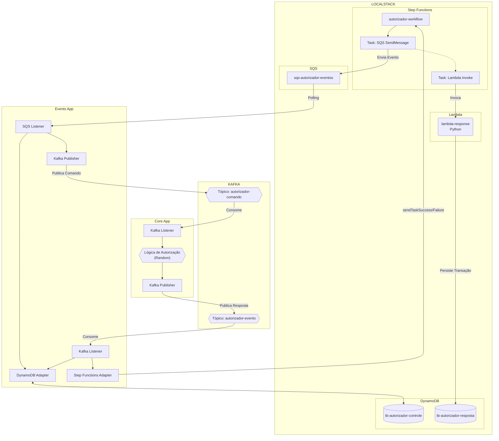
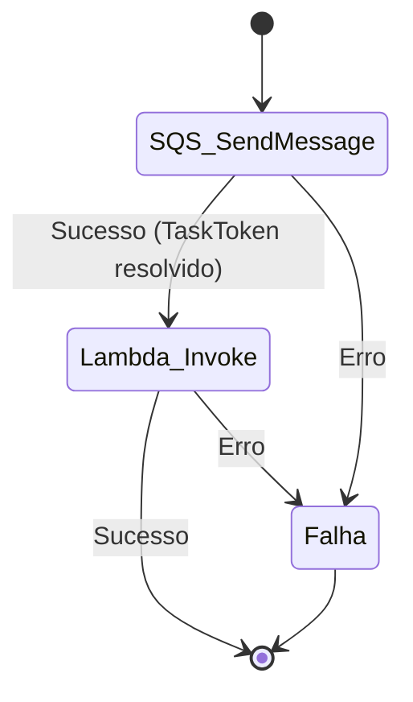
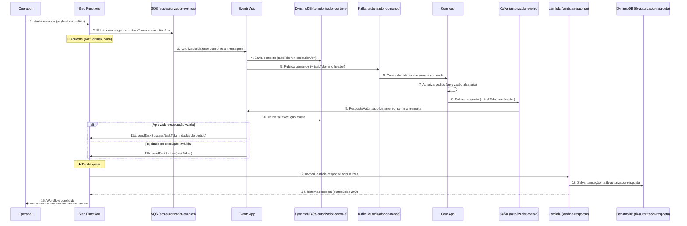

# POC Autorizador

Prova de conceito de um sistema de **autorização de pedidos** baseado em arquitetura orientada a eventos, utilizando **AWS Step Functions**, **SQS**, **DynamoDB**, **Lambda**, **Kafka** e dois microsserviços Spring Boot — tudo executando localmente via **LocalStack** e **Docker Compose**.

---

## Índice

- [Visão Geral da Arquitetura](#visão-geral-da-arquitetura)
- [Stack Tecnológica](#stack-tecnológica)
- [Estrutura do Projeto](#estrutura-do-projeto)
- [Componentes](#componentes)
  - [Infraestrutura (Docker Compose)](#infraestrutura-docker-compose)
  - [Events App (Spring Boot)](#events-app-spring-boot)
  - [Core App (Spring Boot)](#core-app-spring-boot)
  - [Lambda (Python)](#lambda-python)
  - [Step Function](#step-function)
  - [LocalStack Init](#localstack-init)
- [Fluxo de Execução Completo](#fluxo-de-execução-completo)
- [Tópicos Kafka e Contratos de Dados](#tópicos-kafka-e-contratos-de-dados)
- [Recursos AWS (LocalStack)](#recursos-aws-localstack)
- [Como Executar](#como-executar)
- [Comandos Úteis](#comandos-úteis)

---

## Visão Geral da Arquitetura

```
┌─────────────────────────────────────────────────────────────────────────────┐
│                            LOCALSTACK (AWS)                                │
│                                                                             │
│  ┌──────────────────┐    ┌──────────────────────┐    ┌───────────────────┐  │
│  │  Step Functions   │───▶│  SQS                 │    │  DynamoDB         │  │
│  │  (autorizador-    │    │  (sqs-autorizador-   │    │  ┌─────────────┐  │  │
│  │   workflow)       │    │   eventos)           │    │  │tb-autorizador│  │  │
│  │                   │◀──┐│                      │    │  │  -controle  │  │  │
│  │  ┌─────────────┐  │   ││                      │    │  ├─────────────┤  │  │
│  │  │SQS Send     │──┘   │└──────────┬───────────┘    │  │tb-autorizador│  │  │
│  │  │(waitFor     │      │           │                │  │  -resposta  │  │  │
│  │  │ TaskToken)  │      │           │ polling        │  └─────────────┘  │  │
│  │  ├─────────────┤      │           │                │                   │  │
│  │  │Lambda       │      │           ▼                │                   │  │
│  │  │Invoke       │      │  ┌────────────────────┐    │                   │  │
│  │  └──────┬──────┘      │  │   EVENTS-APP       │    │                   │  │
│  │         │             │  │   (Spring Boot)    │────┘                   │  │
│  │         ▼             │  │                    │                        │  │
│  │  ┌─────────────┐     │  │  SQS Listener ──▶  │                        │  │
│  │  │lambda-      │     │  │  Kafka Publisher    │                        │  │
│  │  │response     │     │  │       │             │                        │  │
│  │  │(Python)     │     │  │       │ autorizador │                        │  │
│  │  └─────────────┘     │  │       │  -comando   │                        │  │
│  └──────────────────┘   │  │       ▼             │                        │  │
│                          │  │  Kafka Listener ◀──│───── autorizador-evento│  │
│                          │  │  SFN Response      │                        │  │
│                          │  └────────────────────┘                        │  │
│                          │           │                                     │  │
│                          │           │ autorizador-comando                 │  │
│                          │           ▼                                     │  │
│                          │  ┌────────────────────┐                        │  │
│                          │  │   CORE-APP         │                        │  │
│                          │  │   (Spring Boot)    │                        │  │
│                          │  │                    │                        │  │
│                          │  │  Kafka Listener ──▶│                        │  │
│                          │  │  Autoriza (random) │                        │  │
│                          │  │  Kafka Publisher ──│───── autorizador-evento│  │
│                          │  └────────────────────┘                        │  │
└─────────────────────────────────────────────────────────────────────────────┘
```



---

## Stack Tecnológica

| Componente       | Tecnologia                                                  |
| ---------------- | ----------------------------------------------------------- |
| **Events App**   | Java 21, Spring Boot 4.1, Spring Cloud AWS 4.0.2, Kafka     |
| **Core App**     | Java 21, Spring Boot 4.1, Kafka                             |
| **Lambda**       | Python 3.14, boto3                                          |
| **Broker**       | Apache Kafka (Confluent 7.6.0, KRaft mode)                  |
| **AWS Local**    | LocalStack 4.14.0 (SQS, DynamoDB, Lambda, Step Functions, IAM) |
| **Orquestração** | Docker Compose                                              |
| **Libs comuns**  | Lombok, MapStruct 1.6.3, Jackson, AWS SDK v2 2.46.21        |

---

## Estrutura do Projeto

```
poc-autorizador/
├── compose.yml                  # Docker Compose com Kafka, LocalStack e Kafka UI
├── arch.drawio                  # Diagrama de arquitetura (draw.io)
│
├── localstack-init/
│   └── init-aws.sh              # Script de inicialização dos recursos AWS no LocalStack
│
├── stepfunction/
│   └── definition.json          # Definição da State Machine (ASL/JSONata)
│
├── lambda/                      # AWS Lambda (Python) — lambda-response
│   ├── index.py                 # Handler principal
│   ├── requirements.txt
│   ├── application/
│   │   └── usecases.py          # SaveTransactionUseCase
│   ├── domain/
│   │   ├── entities.py          # Transaction
│   │   └── ports.py             # TransactionRepository (interface)
│   └── infra/
│       └── adapters.py          # DynamoDBTransactionRepository
│
├── events-app/events/           # Microsserviço Spring Boot — Events
│   ├── pom.xml
│   └── src/main/java/.../events/
│       ├── EventsApplication.java
│       ├── application/
│       │   ├── usecases/
│       │   │   └── AutorizadorUseCase.java
│       │   └── exceptions/
│       │       └── SemTaskTokenException.java
│       ├── domain/
│       │   ├── entities/
│       │   │   └── Pedido.java
│       │   └── ports/
│       │       ├── in/AutorizadorInputPort.java
│       │       └── out/
│       │           ├── EventPublisherPort.java
│       │           ├── WorkflowRepositoryPort.java
│       │           └── WorkflowResponsePort.java
│       └── infrastructure/
│           ├── adapters/
│           │   ├── EventPublisherAdapter.java       # Publica no Kafka (autorizador-comando)
│           │   ├── WorkflowRepositoryAdapter.java   # Salva/consulta contexto no DynamoDB
│           │   └── WorkflowResponseAdapter.java     # Envia sendTaskSuccess/Failure ao SFN
│           ├── listeners/
│           │   ├── AutorizadorListener.java          # Consome SQS
│           │   └── RespostaAutorizadorListener.java  # Consome Kafka (autorizador-evento)
│           ├── dtos/
│           │   ├── kafka/
│           │   │   ├── TopicoComandoPayload.java
│           │   │   └── TopicoEventoPayload.java
│           │   └── sqs/
│           │       ├── SqsEventPayloadDto.java
│           │       ├── EventDetailsDto.java
│           │       └── WorkflowContextDto.java
│           ├── entities/
│           │   └── WorkflowContextEntity.java
│           ├── mappers/
│           │   ├── PedidoMapper.java
│           │   └── WorkflowContextMapper.java
│           ├── configurations/
│           │   ├── DynamoDbConfiguration.java
│           │   ├── MapperConfiguration.java
│           │   ├── SqsConfiguration.java
│           │   └── StepFunctionConfiguration.java
│           ├── properties/
│           │   └── KafkaPublisherProperties.java
│           ├── resolvers/
│           │   └── TableNameResolver.java
│           └── exceptions/
│               ├── AutorizadorListenerException.java
│               ├── PublisherException.java
│               └── WorkflowResponseException.java
│
└── core-app/core/               # Microsserviço Spring Boot — Core
    ├── pom.xml
    └── src/main/java/.../core/
        ├── CoreApplication.java
        ├── application/usecases/
        │   └── AutorizadorUsecase.java        # Lógica de autorização (random)
        ├── domain/
        │   ├── entities/
        │   │   ├── Pedido.java
        │   │   └── Resposta.java
        │   └── ports/
        │       ├── in/AutorizadorResponsePort.java
        │       └── out/RespostaSenderPort.java
        └── infrastructure/
            ├── listeners/
            │   └── ComandoListener.java        # Consome Kafka (autorizador-comando)
            ├── publishers/
            │   └── RespostaPublisher.java      # Publica no Kafka (autorizador-evento)
            ├── dtos/
            │   ├── TopicoComandoPayload.java
            │   └── TopicoEventoPayload.java
            ├── mappers/
            │   ├── ComandoMapper.java
            │   └── EventoMapper.java
            ├── configurations/
            │   └── MapperConfiguration.java
            └── exceptions/
                └── ListenerException.java
```

---

## Componentes

### Infraestrutura (Docker Compose)

O arquivo [`compose.yml`](compose.yml) orquestra os seguintes containers:

| Serviço              | Imagem                              | Porta(s)           | Descrição                                                                       |
| -------------------- | ----------------------------------- | ------------------ | ------------------------------------------------------------------------------- |
| `autorizador-kafka`  | `confluentinc/cp-kafka:7.6.0`      | `9092`, `29092`    | Broker Kafka em modo KRaft (sem ZooKeeper). Porta `29092` para acesso externo.  |
| `kafka-init`         | `confluentinc/cp-kafka:7.6.0`      | —                  | Container efêmero que cria os tópicos `autorizador-evento` e `autorizador-comando`. |
| `kafka-ui`           | `provectuslabs/kafka-ui:latest`     | `9000`             | Interface web para visualização dos tópicos e mensagens Kafka.                  |
| `aws-autorizador`    | `localstack/localstack:4.14.0`     | `4566`             | Emula serviços AWS: Lambda, DynamoDB, SQS, Step Functions e IAM.               |

Todos os containers compartilham a rede Docker `autorizador-net`.

---

### Events App (Spring Boot)

**Papel:** Microsserviço orquestrador de eventos. Atua como ponte entre o mundo AWS (SQS / Step Functions / DynamoDB) e o mundo Kafka.

**Arquitetura interna:** Hexagonal (Ports & Adapters)

#### Listeners

| Classe | Origem | Descrição |
| --- | --- | --- |
| [`AutorizadorListener`](events-app/events/src/main/java/com/gasfgrv/autorizador/events/infrastructure/listeners/AutorizadorListener.java) | Fila SQS `sqs-autorizador-eventos` | Recebe a mensagem vinda do Step Functions (com `taskToken` e `executionArn`). Salva o contexto do workflow no DynamoDB e publica um comando no Kafka. |
| [`RespostaAutorizadorListener`](events-app/events/src/main/java/com/gasfgrv/autorizador/events/infrastructure/listeners/RespostaAutorizadorListener.java) | Tópico Kafka `autorizador-evento` | Recebe a resposta de autorização do **Core App**. Extrai o `taskToken` do header Kafka e chama o Step Functions com `sendTaskSuccess` ou `sendTaskFailure`. |

#### Adapters de Saída

| Classe | Destino | Descrição |
| --- | --- | --- |
| [`EventPublisherAdapter`](events-app/events/src/main/java/com/gasfgrv/autorizador/events/infrastructure/adapters/EventPublisherAdapter.java) | Tópico Kafka `autorizador-comando` | Publica o comando de autorização para o Core App, incluindo o `taskToken` como header Kafka. |
| [`WorkflowRepositoryAdapter`](events-app/events/src/main/java/com/gasfgrv/autorizador/events/infrastructure/adapters/WorkflowRepositoryAdapter.java) | DynamoDB `tb-autorizador-controle` | Persiste e consulta o contexto de execução do workflow (`taskToken` + `executionArn`). |
| [`WorkflowResponseAdapter`](events-app/events/src/main/java/com/gasfgrv/autorizador/events/infrastructure/adapters/WorkflowResponseAdapter.java) | AWS Step Functions | Envia `sendTaskSuccess` ou `sendTaskFailure` para desbloquear o Step Functions. |

#### Use Case

[`AutorizadorUseCase`](events-app/events/src/main/java/com/gasfgrv/autorizador/events/application/usecases/AutorizadorUseCase.java) implementa duas operações:
- `autorizarPedido(pedido, taskToken)` — publica o evento de comando no Kafka.
- `enviarResposta(pedido, approved, taskToken)` — valida se a execução existe no DynamoDB e responde ao Step Functions.

---

### Core App (Spring Boot)

**Papel:** Microsserviço que contém a lógica de negócio de **autorização**. Recebe comandos via Kafka, processa a autorização e publica o resultado de volta no Kafka.

**Arquitetura interna:** Hexagonal (Ports & Adapters)

#### Listener

| Classe | Origem | Descrição |
| --- | --- | --- |
| [`ComandoListener`](core-app/core/src/main/java/com/gasfgrv/autorizador/core/infrastructure/listeners/ComandoListener.java) | Tópico Kafka `autorizador-comando` | Consome comandos de autorização, extrai o `taskToken` do header e delega para o use case. |

#### Publisher

| Classe | Destino | Descrição |
| --- | --- | --- |
| [`RespostaPublisher`](core-app/core/src/main/java/com/gasfgrv/autorizador/core/infrastructure/publishers/RespostaPublisher.java) | Tópico Kafka `autorizador-evento` | Publica a resposta de autorização (aprovado/rejeitado), propagando o `taskToken` como header Kafka. |

#### Use Case

[`AutorizadorUsecase`](core-app/core/src/main/java/com/gasfgrv/autorizador/core/application/usecases/AutorizadorUsecase.java) — Executa a lógica de autorização. Nesta POC, a decisão de aprovação é **aleatória** (`Random.nextBoolean()`), simulando um autorizador externo. Cria uma entidade [`Resposta`](core-app/core/src/main/java/com/gasfgrv/autorizador/core/domain/entities/Resposta.java) com os dados do pedido + flag `aprovado` e envia para o publisher.

---

### Lambda (Python)

**Papel:** Função AWS Lambda (`lambda-response`) invocada pelo Step Functions como último passo do workflow. Persiste os dados da transação autorizada no DynamoDB.

**Arquitetura interna:** Hexagonal (Ports & Adapters)

| Camada | Arquivo | Descrição |
| --- | --- | --- |
| **Handler** | [`index.py`](lambda/index.py) | Entry point da Lambda. Faz parse do evento, invoca o use case e retorna a resposta. |
| **Application** | [`usecases.py`](lambda/application/usecases.py) | `SaveTransactionUseCase` — Cria uma `Transaction` a partir do payload e salva via repositório. |
| **Domain** | [`entities.py`](lambda/domain/entities.py) | `Transaction` — Entidade com ID gerado automaticamente (`transaction_{random}_{timestamp}`). |
| **Domain** | [`ports.py`](lambda/domain/ports.py) | `TransactionRepository` — Interface abstrata do repositório. |
| **Infra** | [`adapters.py`](lambda/infra/adapters.py) | `DynamoDBTransactionRepository` — Implementação que persiste na tabela `tb-autorizador-resposta`. |

---

### Step Function

A State Machine [`autorizador-workflow`](stepfunction/definition.json) é definida com **JSONata** como query language e possui 3 estados:



| Estado | Tipo | Recurso | Descrição |
| --- | --- | --- | --- |
| **SQS SendMessage** | Task (`waitForTaskToken`) | `sqs:sendMessage` | Publica a mensagem na fila SQS `sqs-autorizador-eventos` incluindo o `taskToken` e o `executionArn`. **Bloqueia** a execução até receber um `sendTaskSuccess` ou `sendTaskFailure`. |
| **Lambda Invoke** | Task | `lambda:invoke` | Invoca a função `lambda-response` com o output da etapa anterior. Possui retry automático com backoff exponencial e jitter. |
| **Falha** | Fail | — | Estado terminal de erro. Acionado pelo `Catch` de qualquer etapa anterior. |

---

### LocalStack Init

O script [`init-aws.sh`](localstack-init/init-aws.sh) é executado automaticamente quando o container LocalStack fica pronto (`ready.d`). Ele provisiona todos os recursos AWS necessários:

1. **DynamoDB** — Tabela `tb-autorizador-controle` (PK: `id_exec`)
2. **DynamoDB** — Tabela `tb-autorizador-resposta` (PK: `id_transacao`)
3. **SQS** — Fila `sqs-autorizador-eventos`
4. **IAM** — Role `execution-role` (para Lambda e Step Functions)
5. **Lambda** — Função `lambda-response` (empacota e faz deploy do código Python)
6. **Step Functions** — State Machine `autorizador-workflow`

---

## Fluxo de Execução Completo

O fluxo completo de autorização de um pedido segue estas etapas:



### Passo a Passo Detalhado

1. **Início do Workflow** — O operador executa o comando `awslocal stepfunctions start-execution` com o payload JSON do pedido (dados do cartão, valor, cliente, etc.).

2. **Step Functions → SQS** — O primeiro estado (`SQS SendMessage`) publica a mensagem na fila SQS `sqs-autorizador-eventos`, injetando o `taskToken` e o `executionArn` no corpo da mensagem via expressão JSONata. A execução do Step Functions **fica bloqueada** (padrão `waitForTaskToken`).

3. **SQS → Events App** — O `AutorizadorListener` do Events App consome a mensagem da fila SQS com acknowledge manual.

4. **Events App → DynamoDB** — O contexto do workflow (`taskToken` + `executionArn`) é persistido na tabela `tb-autorizador-controle` para ser consultado na etapa de resposta.

5. **Events App → Kafka** — Os dados do pedido são publicados no tópico Kafka `autorizador-comando` com o `taskToken` incluído como header da mensagem Kafka.

6. **Kafka → Core App** — O `ComandoListener` do Core App consome a mensagem do tópico `autorizador-comando` e extrai o `taskToken` do header.

7. **Core App: Autorização** — O `AutorizadorUsecase` processa o pedido. Nesta POC, a decisão de aprovação é simulada com `Random.nextBoolean()`. Uma entidade `Resposta` é criada com todos os dados do pedido e a flag `aprovado`.

8. **Core App → Kafka** — A resposta é publicada no tópico `autorizador-evento` com o `taskToken` propagado como header.

9. **Kafka → Events App** — O `RespostaAutorizadorListener` consome a resposta do tópico `autorizador-evento` e extrai o `taskToken` do header.

10. **Events App → DynamoDB** — A aplicação consulta a tabela `tb-autorizador-controle` para verificar se a execução referenciada pelo `taskToken` ainda existe/é válida.

11. **Events App → Step Functions** — Com base na validação e no campo `approved`:
    - **Sucesso:** chama `sendTaskSuccess` com o `taskToken` e os dados do pedido como output.
    - **Falha:** chama `sendTaskFailure` com o `taskToken`.

12. **Step Functions → Lambda** — O Step Functions desbloqueia e avança para o segundo estado (`Lambda Invoke`), invocando a função `lambda-response` com o output da etapa anterior.

13. **Lambda → DynamoDB** — A Lambda cria um registro de `Transaction` com um ID único e salva na tabela `tb-autorizador-resposta`.

14. **Lambda → Step Functions** — Retorna `statusCode: 200` com os dados da transação registrada.

15. **Conclusão** — O workflow do Step Functions é finalizado com sucesso.

---

## Tópicos Kafka e Contratos de Dados

### Tópicos

| Tópico | Produtor | Consumidor | Descrição |
| --- | --- | --- | --- |
| `autorizador-comando` | Events App | Core App | Comando de autorização de pedido |
| `autorizador-evento`  | Core App   | Events App | Resposta da autorização (aprovado/rejeitado) |

### Payload do `autorizador-comando` (snake_case)

```json
{
  "order_id": "1234567",
  "customer_id": "98766",
  "order_date": "2024-01-14",
  "amount": 100,
  "name_on_card": "FIRSTNAME LASTNAME",
  "credit_card_number": "1234 1234 1234 1234",
  "expiry": "XX/YY",
  "cvv": "123"
}
```
**Header Kafka:** `taskToken` (bytes)

### Payload do `autorizador-evento` (snake_case)

```json
{
  "order_id": "1234567",
  "customer_id": "98766",
  "order_date": "2024-01-14",
  "amount": 100,
  "name_on_card": "FIRSTNAME LASTNAME",
  "credit_card_number": "1234 1234 1234 1234",
  "expiry": "XX/YY",
  "cvv": "123",
  "approved": true
}
```
**Header Kafka:** `taskToken` (bytes)

---

## Recursos AWS (LocalStack)

| Serviço | Recurso | Detalhes |
| --- | --- | --- |
| **DynamoDB** | `tb-autorizador-controle` | PK: `id_exec` (String). Armazena contexto do workflow. |
| **DynamoDB** | `tb-autorizador-resposta` | PK: `id_transacao` (String). Armazena transações processadas pela Lambda. |
| **SQS** | `sqs-autorizador-eventos` | Fila padrão. Ponte entre Step Functions e Events App. |
| **Lambda** | `lambda-response` | Runtime Python 3.14. Persiste transações no DynamoDB. |
| **Step Functions** | `autorizador-workflow` | State Machine com 3 estados (SQS → Lambda → Falha). |
| **IAM** | `execution-role` | Role compartilhada por Lambda e Step Functions. |

---

## Como Executar

### Pré-requisitos

- Docker e Docker Compose
- AWS CLI com plugin `awslocal` ([LocalStack CLI](https://docs.localstack.cloud/getting-started/installation/))
- Java 21 + Maven (para os microsserviços Spring Boot)

### 1. Subir a infraestrutura

```sh
docker compose up -d
```

Isso inicia o Kafka, Kafka UI, e o LocalStack (que automaticamente provisiona DynamoDB, SQS, Lambda, Step Functions e IAM via `init-aws.sh`).

### 2. Iniciar os microsserviços

Em terminais separados:

```sh
# Events App
cd events-app/events
./mvnw spring-boot:run

# Core App
cd core-app/core
./mvnw spring-boot:run
```

### 3. Disparar uma execução

```sh
awslocal stepfunctions start-execution \
  --state-machine-arn arn:aws:states:us-east-1:000000000000:stateMachine:autorizador-workflow \
  --input "{\"orderId\":\"1234567\",\"customerId\":\"98766\",\"orderDate\":\"2024-01-14\",\"amount\":100,\"nameOnCard\":\"FIRSTNAME LASTNAME\",\"creditCardNumber\":\"1234 1234 1234 1234\",\"expiry\":\"XX/YY\",\"cvv\":\"123\"}"
```

### Payload de exemplo

```json
{
  "orderId": "1234567",
  "customerId": "98766",
  "orderDate": "2024-01-14",
  "amount": 100,
  "nameOnCard": "FIRSTNAME LASTNAME",
  "creditCardNumber": "1234 1234 1234 1234",
  "expiry": "XX/YY",
  "cvv": "123"
}
```

---

## Comandos Úteis

```sh
# Listar execuções do workflow
awslocal stepfunctions list-executions \
  --state-machine-arn arn:aws:states:us-east-1:000000000000:stateMachine:autorizador-workflow

# Consultar histórico de uma execução específica
awslocal stepfunctions get-execution-history \
  --execution-arn arn:aws:states:us-east-1:000000000000:execution:autorizador-workflow:<EXECUTION_ID>

# Listar itens na tabela de controle
awslocal dynamodb scan --table-name tb-autorizador-controle

# Listar itens na tabela de respostas
awslocal dynamodb scan --table-name tb-autorizador-resposta

# Consultar mensagens na fila SQS
awslocal sqs receive-message --queue-url http://sqs.us-east-1.localhost.localstack.cloud:4566/000000000000/sqs-autorizador-eventos

# Acessar Kafka UI
# http://localhost:9000
```